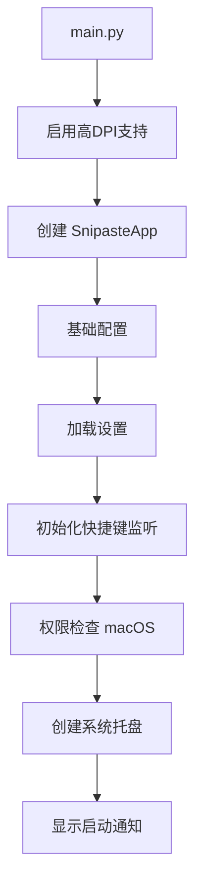
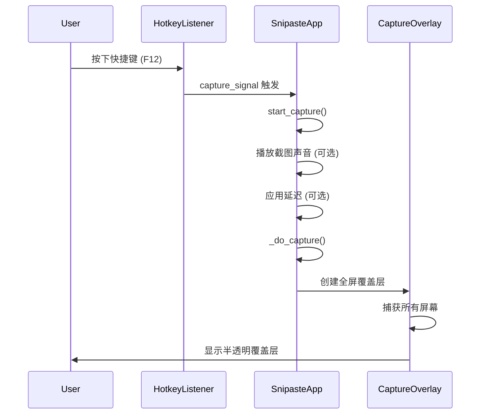
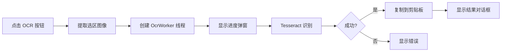
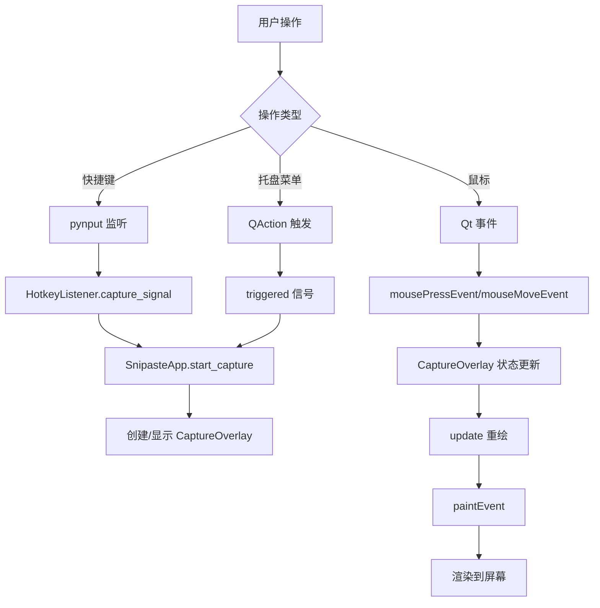
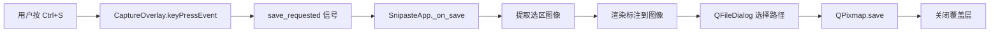
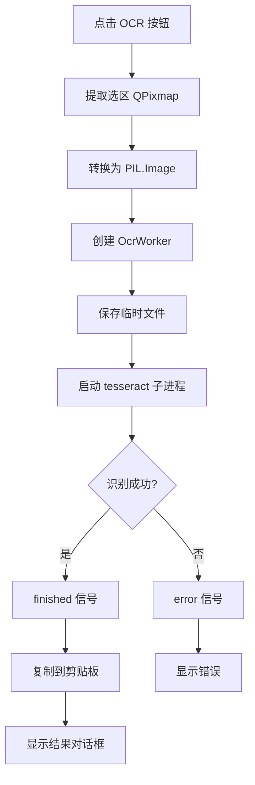

# openSnipaste 架构与执行流程

本文档详细介绍 openSnipaste 项目的架构设计、执行流程和各功能的实现方式。

## 📋 项目概述

openSnipaste 是一个基于 **PySide6 (Qt6)** 的跨平台截图工具，核心功能包括：
- 📸 截图（多屏支持、高DPI适配）
- ✏️ 标注（形状、箭头、画笔、马赛克、文字）
- 📌 贴图（钉到桌面）
- 🔍 OCR 文字识别（中英文）

**技术栈**：
- Python 3.12+
- PySide6 (Qt6)
- Pillow (图像处理)
- pytesseract (OCR)
- pynput (全局快捷键)

---

## 🔄 程序执行流程

### 1️⃣ 启动流程



#### SnipasteApp 初始化详解 (`src/app.py:59-102`)

**步骤 1: 基础配置**
```python
# 设置应用元数据
self.setApplicationName("openSnipaste")
self.setOrganizationName("openSnipaste")
self.setQuitOnLastWindowClosed(False)  # 托盘应用不随窗口关闭退出
```

**步骤 2: 设置管理** (`src/core/settings.py`)
- 从 `~/.config/openSnipaste/settings.json` 加载配置
- 支持的设置项：
  - 快捷键 (`hotkey`)
  - 语言 (`language`)
  - 默认颜色/线宽 (`default_color`, `default_line_width`)
  - OCR 语言 (`ocr_language`)
  - 截图选项 (`capture_cursor`, `capture_delay`, `capture_sound`)
  - 日志级别 (`log_level`)

**步骤 3: 快捷键系统** (`src/core/hotkeys.py`)
- 创建 `HotkeyListener` 监听全局快捷键
- 平台默认快捷键：
  - Windows/Linux: `F12`
  - macOS: `Cmd+Shift+X` (F12被系统占用)
- 使用 `pynput` 库实现跨平台键盘监听
- 信号机制：`capture_signal.emit()` → `start_capture()`

**步骤 4: 权限检查** (macOS专用)
```python
# 检查输入监控权限（用于全局快捷键）
have_hotkey = check_macos_accessibility()

# 截图时检查屏幕录制权限
check_screen_recording_permission()
```

**步骤 5: 系统托盘** (`src/ui/tray.py`)
- 托盘菜单项：
  - 截图 (Capture)
  - OCR 剪贴板图片
  - 设置
  - 检查权限 (macOS)
  - 查看日志
  - 退出
- macOS: 左键点击显示菜单
- 其他平台: 双击启动截图

---

### 2️⃣ 截图流程（核心功能）



#### CaptureOverlay 初始化 (`src/overlay/widget.py:31-102`)

**步骤 1: 屏幕捕获** (`src/core/utils.py:capture_all_screens`)
```python
# 获取所有显示器的几何信息
total_geometry = QRect()
for screen in QApplication.screens():
    total_geometry = total_geometry.united(screen.geometry())

# 捕获屏幕（支持多屏、高DPI、光标）
screenshot = capture_all_screens(include_cursor=True)
```

**步骤 2: 创建全屏透明窗口**
```python
self.setWindowFlags(
    Qt.FramelessWindowHint |    # 无边框
    Qt.WindowStaysOnTopHint |   # 置顶
    Qt.Tool                     # 工具窗口（不显示任务栏）
)
self.setAttribute(Qt.WA_TranslucentBackground)  # 透明背景
self.setGeometry(total_geometry)                # 覆盖所有屏幕
self.setCursor(Qt.CrossCursor)                  # 十字光标
```

**步骤 3: 初始化状态管理**
```python
# 选区状态
self.is_selecting = False
self.selection_rect = QRect()

# 标注系统
self.annotations = []           # 标注列表
self._redo_stack = []           # 重做栈
self.current_tool = "select"    # 当前工具

# 工具栏
self.toolbar = OverlayToolbar(self)
self.toolbar.setup()
```

---

### 3️⃣ 选区和标注流程

#### 选区操作 (`src/overlay/widget.py`)

**鼠标事件流程**：
```python
mousePressEvent():
    if 未选区:
        开始选区 (is_selecting = True)
    elif 点击调整手柄:
        开始调整选区大小 (_drag_mode)
    elif 点击选区内部:
        if current_tool == "select":
            开始移动选区
        else:
            开始绘制标注 (_drawing = True)

mouseMoveEvent():
    if 正在选区:
        更新选区矩形 (end_point)
    elif 正在调整选区:
        调整选区大小
    elif 正在绘制:
        记录绘制点 / 更新预览

mouseReleaseEvent():
    if 完成选区:
        显示工具栏
    elif 完成绘制:
        保存标注到 annotations 列表
    清空预览状态
```

**选区手柄系统**：
- 8个调整手柄：4个角 + 4个边中点
- 手柄检测：`_handle_at_pos()` 判断鼠标是否在手柄区域
- 光标变化：根据手柄位置显示不同的调整光标

#### 标注工具实现 (`src/overlay/actions.py` + `rendering.py`)

**支持的工具类型**：
1. **形状 (rect/ellipse)**
   - 矩形、圆形
   - 支持填充 (`filled: bool`)
   - 颜色、线宽可调

2. **箭头 (arrow/line)**
   - 有箭头线条 / 无箭头线条
   - 使用 `QPainterPath` 绘制箭头头部

3. **画笔 (pen)**
   - 自由手绘
   - 存储路径点列表 (`points: List[QPointF]`)
   - 使用贝塞尔曲线平滑

4. **马赛克 (mosaic)**
   - 像素化模糊效果
   - 实现：将区域缩小后放大，产生马赛克效果

5. **文字 (text)**
   - 富文本编辑
   - 支持字体、字号、加粗、斜体、颜色

6. **橡皮擦 (eraser)**
   - 点击删除单个标注
   - 拖动框选删除多个标注

**标注数据结构**：
```python
annotation = {
    "type": "rect",              # 类型
    "start": QPointF(10, 20),    # 起点
    "end": QPointF(100, 80),     # 终点
    "points": [...],             # 画笔路径点
    "color": QColor("#ff0000"),  # 颜色
    "width": 3,                  # 线宽
    "filled": False,             # 是否填充
    "text": "Hello",             # 文字内容
    "font_family": "Arial",      # 字体
    "font_size": 16,             # 字号
    "bold": False,               # 加粗
    "italic": False              # 斜体
}
```

**渲染流程** (`src/overlay/rendering.py`)：
```python
def _render_annotations(painter, annotations):
    for ann in annotations:
        if ann["type"] == "rect":
            _render_rect(painter, ann)
        elif ann["type"] == "ellipse":
            _render_ellipse(painter, ann)
        elif ann["type"] == "arrow":
            _render_arrow(painter, ann)
        elif ann["type"] == "pen":
            _render_pen(painter, ann)
        elif ann["type"] == "mosaic":
            _render_mosaic(painter, ann)
        elif ann["type"] == "text":
            _render_text(painter, ann)
```

**撤销/重做机制**：
```python
# 撤销 (Ctrl+Z)
def undo():
    if annotations:
        last = annotations.pop()
        _redo_stack.append(last)

# 重做 (Ctrl+Y)
def redo():
    if _redo_stack:
        ann = _redo_stack.pop()
        annotations.append(ann)
```

---

### 4️⃣ OCR 文字识别流程

#### 截图 OCR (`src/overlay/ocr_mixin.py`)



**实现代码**：
```python
def _do_ocr_screenshot():
    # 1. 提取选区图像
    cropped = full_screenshot.copy(selection_rect)
    pil_image = qpixmap_to_pil(cropped)
    
    # 2. 创建后台线程
    worker = OcrWorker(pil_image)
    worker.finished.connect(on_ocr_finished)
    worker.error.connect(on_ocr_error)
    
    # 3. 显示进度对话框
    progress_dialog.show()
    worker.start()
```

#### 剪贴板 OCR (`src/app.py:ocr_clipboard`)

```python
def ocr_clipboard():
    # 1. 从剪贴板获取图片
    pixmap = QApplication.clipboard().pixmap()
    
    # 2. 识别文字
    text = extract_text(pixmap)
    
    # 3. 复制结果
    QApplication.clipboard().setText(text)
    
    # 4. 显示结果
    QMessageBox.information(None, "OCR Result", text)
```

#### OCR 引擎 (`src/ocr/engine.py`)

**Tesseract 初始化流程**：
```python
def setup_bundled_tesseract():
    if getattr(sys, 'frozen', False):
        # 打包版本：从 _MEIPASS 加载
        base_dir = sys._MEIPASS
        tesseract_exe = os.path.join(base_dir, 'tesseract', 'tesseract.exe')
        tesseract_data = os.path.join(base_dir, 'tesseract', 'tessdata')
        
        pytesseract.tesseract_cmd = tesseract_exe
        os.environ['TESSDATA_PREFIX'] = tesseract_data
    else:
        # 开发版本：使用系统 Tesseract
        pytesseract.get_tesseract_version()
```

**OcrWorker 后台线程**：
```python
class OcrWorker(QThread):
    def run(self):
        # 1. 保存临时图片
        tmp_dir = tempfile.mkdtemp()
        input_path = os.path.join(tmp_dir, "input.png")
        self.pil_image.save(input_path)
        
        # 2. 调用 tesseract 子进程
        self._proc = subprocess.Popen([
            tesseract_cmd, input_path, output_base,
            "-l", "eng+chi_sim"  # 中英文识别
        ])
        
        # 3. 等待完成（支持超时/取消）
        self._proc.communicate(timeout=60)
        
        # 4. 读取结果
        with open(output_path) as f:
            text = f.read()
        
        # 5. 发送信号
        self.finished.emit(text)
    
    def cancel(self):
        # 终止 tesseract 子进程（而非 Python 线程）
        if self._proc:
            self._proc.kill()
```

---

### 5️⃣ 贴图功能 (`src/ui/pin_window.py`)

**使用流程**：
```
选区完成 → 按 Ctrl/Cmd+P → 创建 PinWindow → 置顶显示 → 双击关闭
```

**PinWindow 实现**：
```python
class PinWindow(QWidget):
    def __init__(self, pixmap, pos):
        super().__init__()
        
        # 窗口属性
        self.setWindowFlags(
            Qt.FramelessWindowHint |      # 无边框
            Qt.WindowStaysOnTopHint |     # 置顶
            Qt.Tool                       # 工具窗口
        )
        
        # 显示标注后的截图
        self.pixmap = pixmap
        self.setFixedSize(pixmap.size())
        self.move(pos)
    
    def mouseDoubleClickEvent(self, event):
        # 双击关闭
        self.close()
    
    def mousePressEvent(self, event):
        # 拖动支持
        self.drag_start_pos = event.globalPos() - self.pos()
    
    def mouseMoveEvent(self, event):
        # 移动窗口
        self.move(event.globalPos() - self.drag_start_pos)
```

---

### 6️⃣ 保存和复制

#### 保存流程 (`src/app.py:_on_save`)

```python
def _on_save(pixmap):
    # 1. 生成默认文件名
    default_name = f"Screenshot_{datetime.now():%Y%m%d_%H%M%S}.png"
    
    # 2. 显示保存对话框
    file_path, _ = QFileDialog.getSaveFileName(
        parent, "Save Screenshot", default_name,
        "PNG Image (*.png);;JPEG Image (*.jpg *.jpeg)"
    )
    
    # 3. 保存文件
    if file_path:
        pixmap.save(file_path)
        
        # 4. 记住保存目录
        self._last_save_dir = os.path.dirname(file_path)
        
        # 5. 关闭截图界面
        self.overlay.close()
```

#### 复制流程 (`src/app.py:_on_copy`)

```python
def _on_copy(pixmap):
    # 复制到剪贴板
    QApplication.clipboard().setPixmap(pixmap)
    
    # 关闭截图界面
    self.overlay.close()
```

---

## 🏗️ 架构设计

### 模块分层

```
┌─────────────────────────────────────────┐
│           main.py (入口)                │
└─────────────────────────────────────────┘
                    ↓
┌─────────────────────────────────────────┐
│         src/app.py (主应用)             │
│  - 应用生命周期管理                      │
│  - 快捷键系统                            │
│  - 截图流程控制                          │
│  - 信号/槽连接                           │
└─────────────────────────────────────────┘
         ↓              ↓              ↓
┌──────────────┐ ┌──────────────┐ ┌──────────────┐
│  core/       │ │  overlay/    │ │  ui/         │
│  基础层       │ │  截图覆盖层   │ │  界面组件    │
└──────────────┘ └──────────────┘ └──────────────┘
         ↓              ↓              ↓
┌──────────────┐ ┌──────────────┐ ┌──────────────┐
│ - settings   │ │ - widget     │ │ - tray       │
│ - hotkeys    │ │ - toolbar    │ │ - pin_window │
│ - permissions│ │ - rendering  │ │ - settings   │
│ - utils      │ │ - actions    │ │ - ocr_dialog │
│ - logger     │ │ - ocr_mixin  │ │              │
│ - i18n       │ │              │ │              │
│ - constants  │ │              │ │              │
└──────────────┘ └──────────────┘ └──────────────┘
                       ↓
              ┌──────────────┐
              │  ocr/        │
              │  OCR 引擎    │
              │ - engine     │
              └──────────────┘
```

### 核心类关系

```python
# 主应用类
class SnipasteApp(QApplication):
    - overlay: CaptureOverlay
    - pin_windows: List[PinWindow]
    - tray: TrayManager
    - hotkey_listener: HotkeyListener
    - settings: AppSettings

# 截图覆盖层（Mixin 组合模式）
class CaptureOverlay(QWidget, OcrMixin, OverlayRenderingMixin, OverlayActionsMixin):
    - full_screenshot: QPixmap
    - selection_rect: QRect
    - annotations: List[dict]
    - toolbar: OverlayToolbar
    
    # 信号
    - pin_requested(pixmap, pos)
    - copy_requested(pixmap)
    - save_requested(pixmap)

# 工具栏
class OverlayToolbar:
    - overlay: CaptureOverlay
    - toolbar: QFrame
    - _tool_btns: dict[str, QToolButton]

# 快捷键监听器
class HotkeyListener(QObject):
    - hotkey: str
    - _listener: _PynputListener
    
    # 信号
    - capture_signal()

# OCR 工作线程
class OcrWorker(QThread):
    - pil_image: Image.Image
    - _proc: subprocess.Popen
    
    # 信号
    - finished(str)
    - error(str)
```

### 设计模式

#### 1. Mixin 模式
`CaptureOverlay` 通过多继承组合功能：
```python
class CaptureOverlay(QWidget, OcrMixin, OverlayRenderingMixin, OverlayActionsMixin):
    pass

# OcrMixin: OCR 进度弹窗
# OverlayRenderingMixin: 标注渲染
# OverlayActionsMixin: 操作逻辑（保存/复制/贴图/文字编辑）
```

#### 2. 信号-槽机制
Qt 的事件通信模式：
```python
# 定义信号
class CaptureOverlay(QWidget):
    pin_requested = Signal(object, object)

# 连接槽
overlay.pin_requested.connect(app._on_pin)

# 发射信号
self.pin_requested.emit(pixmap, pos)
```

#### 3. 单例模式
全局设置管理：
```python
_settings_instance: AppSettings | None = None

def get_settings() -> AppSettings:
    global _settings_instance
    if _settings_instance is None:
        _settings_instance = AppSettings.load()
    return _settings_instance
```

#### 4. 策略模式
不同工具的渲染策略：
```python
# 工具渲染策略字典
RENDER_STRATEGIES = {
    "rect": _render_rect,
    "ellipse": _render_ellipse,
    "arrow": _render_arrow,
    "pen": _render_pen,
    "mosaic": _render_mosaic,
    "text": _render_text,
}

# 根据类型选择策略
render_func = RENDER_STRATEGIES[annotation["type"]]
render_func(painter, annotation)
```

---

## 🔑 关键技术点

### 1. 多屏幕截图

**挑战**：支持多显示器、不同 DPI、不同分辨率

**解决方案**：
```python
def capture_all_screens(include_cursor=False):
    # 1. 计算所有屏幕的总几何区域
    total_geometry = QRect()
    for screen in QApplication.screens():
        total_geometry = total_geometry.united(screen.geometry())
    
    # 2. 创建总画布
    result = QPixmap(total_geometry.size())
    result.fill(Qt.transparent)
    
    # 3. 逐个屏幕绘制
    painter = QPainter(result)
    for screen in QApplication.screens():
        geom = screen.geometry()
        screenshot = screen.grabWindow(
            0, geom.x(), geom.y(),
            geom.width(), geom.height()
        )
        offset = geom.topLeft() - total_geometry.topLeft()
        painter.drawPixmap(offset, screenshot)
    
    # 4. 可选：绘制光标
    if include_cursor:
        cursor_pos = QCursor.pos() - total_geometry.topLeft()
        cursor_pixmap = get_cursor_pixmap()
        painter.drawPixmap(cursor_pos, cursor_pixmap)
    
    painter.end()
    return result
```

### 2. 全局快捷键监听

**挑战**：跨平台全局快捷键、权限管理

**解决方案**：
```python
# 使用 pynput 库
from pynput import keyboard

class _PynputListener:
    def __init__(self, hotkey: str):
        self.hotkey = hotkey
        self._current_keys = set()
    
    def _parse_hotkey(self):
        # 解析快捷键字符串 "cmd+shift+x"
        parts = self.hotkey.split('+')
        keys = set()
        for part in parts:
            if part == 'cmd':
                keys.add(keyboard.Key.cmd)
            elif part == 'shift':
                keys.add(keyboard.Key.shift_l)
            elif part.isalpha():
                keys.add(keyboard.KeyCode.from_char(part))
        return keys
    
    def _listen(self):
        required_keys = self._parse_hotkey()
        
        def on_press(key):
            normalized = self._normalize(key)
            self._current_keys.add(normalized)
            
            # 检查是否按下了所有必需的键
            if required_keys.issubset(self._current_keys):
                self.capture_signal.emit()
                self._current_keys.clear()
        
        def on_release(key):
            normalized = self._normalize(key)
            self._current_keys.discard(normalized)
        
        with keyboard.Listener(on_press=on_press, on_release=on_release):
            listener.join()
```

### 3. 半透明窗口与遮罩

**实现方式**：
```python
# 窗口属性
self.setWindowFlags(Qt.FramelessWindowHint | Qt.WindowStaysOnTopHint)
self.setAttribute(Qt.WA_TranslucentBackground)

# 绘制半透明遮罩
def paintEvent(self, event):
    painter = QPainter(self)
    
    # 1. 绘制原始截图
    painter.drawPixmap(0, 0, self.full_screenshot)
    
    # 2. 绘制暗色遮罩（选区外）
    mask_color = QColor(0, 0, 0, 100)  # 半透明黑色
    painter.fillRect(self.rect(), mask_color)
    
    # 3. 清除选区部分（显示原图）
    if not self.selection_rect.isEmpty():
        painter.setCompositionMode(QPainter.CompositionMode_Clear)
        painter.fillRect(self.selection_rect, Qt.transparent)
        painter.setCompositionMode(QPainter.CompositionMode_SourceOver)
```

### 4. 撤销/重做机制

**双栈结构**：
```python
class CaptureOverlay:
    def __init__(self):
        self.annotations = []      # 当前标注栈
        self._redo_stack = []      # 重做栈
    
    def _add_annotation(self, ann):
        self.annotations.append(ann)
        self._redo_stack.clear()   # 新操作清空重做栈
        self.update()
    
    def _undo(self):
        if self.annotations:
            ann = self.annotations.pop()
            self._redo_stack.append(ann)
            self.update()
    
    def _redo(self):
        if self._redo_stack:
            ann = self._redo_stack.pop()
            self.annotations.append(ann)
            self.update()
```

### 5. OCR 异步处理

**关键点**：
- 使用 `QThread` 后台线程
- 通过 `subprocess` 调用 tesseract，而非 Python API（可中断）
- 临时文件管理（自动清理）

```python
class OcrWorker(QThread):
    finished = Signal(str)
    error = Signal(str)
    
    def __init__(self, pil_image):
        super().__init__()
        self.pil_image = pil_image
        self._proc = None
        self._cancelled = False
    
    def cancel(self):
        """中断 OCR（杀死 tesseract 子进程）"""
        self._cancelled = True
        if self._proc:
            self._proc.kill()
    
    def run(self):
        tmp_dir = tempfile.mkdtemp()
        try:
            # 1. 保存临时图片
            input_path = os.path.join(tmp_dir, "input.png")
            self.pil_image.save(input_path)
            
            # 2. 启动 tesseract 子进程
            output_base = os.path.join(tmp_dir, "output")
            self._proc = subprocess.Popen([
                tesseract_cmd, input_path, output_base,
                "-l", "eng+chi_sim"
            ], stdout=subprocess.PIPE, stderr=subprocess.PIPE)
            
            # 3. 等待完成（支持超时）
            try:
                self._proc.communicate(timeout=60)
            except subprocess.TimeoutExpired:
                self._proc.kill()
                if not self._cancelled:
                    self.error.emit("OCR timed out")
                return
            
            # 4. 读取结果
            output_path = output_base + ".txt"
            with open(output_path, encoding="utf-8") as f:
                text = f.read().strip()
            
            # 5. 发送结果
            if not self._cancelled:
                self.finished.emit(text)
        
        finally:
            # 6. 清理临时文件
            self._proc = None
            shutil.rmtree(tmp_dir, ignore_errors=True)
```

### 6. macOS 权限管理

**需要的权限**：
- Input Monitoring（输入监控）：用于全局快捷键
- Screen Recording（屏幕录制）：用于截图

**权限检查流程**：
```python
def check_macos_accessibility() -> bool:
    """检查输入监控权限"""
    if sys.platform != 'darwin':
        return True
    
    # 尝试创建事件监听器（需要权限）
    try:
        from pynput import keyboard
        listener = keyboard.Listener(on_press=lambda k: None)
        listener.start()
        listener.stop()
        return True
    except:
        return False

def check_screen_recording_permission() -> bool | None:
    """检查屏幕录制权限"""
    if sys.platform != 'darwin':
        return True
    
    # 尝试截图（如果失败说明没有权限）
    try:
        screen = QApplication.primaryScreen()
        pixmap = screen.grabWindow(0, 0, 0, 100, 100)
        
        # 检查是否为黑色图片（权限被拒）
        image = pixmap.toImage()
        if image.pixel(50, 50) == qRgb(0, 0, 0):
            # 进一步检查是否真的是黑屏
            all_black = all(
                image.pixel(x, y) == qRgb(0, 0, 0)
                for x in range(0, 100, 10)
                for y in range(0, 100, 10)
            )
            return not all_black
        return True
    except:
        return False
```

**引导用户授权**：
```python
def show_permission_dialog():
    """显示权限引导对话框"""
    msg = QMessageBox()
    msg.setIcon(QMessageBox.Warning)
    msg.setWindowTitle("Permission Required")
    msg.setText(
        "openSnipaste needs permissions to work:\n\n"
        "1. Input Monitoring - for global hotkeys\n"
        "2. Screen Recording - for screenshots\n\n"
        "Click 'Open System Settings' to grant permissions."
    )
    
    open_btn = msg.addButton("Open System Settings", QMessageBox.AcceptRole)
    msg.addButton("Cancel", QMessageBox.RejectRole)
    
    msg.exec()
    
    if msg.clickedButton() == open_btn:
        open_input_monitoring_settings()
        open_screen_recording_settings()

def open_screen_recording_settings():
    """打开系统设置 - 屏幕录制"""
    subprocess.run([
        "open",
        "x-apple.systempreferences:com.apple.preference.security?Privacy_ScreenCapture"
    ])
```

### 7. 国际化 (i18n)

**语言包结构**：
```json
// src/resources/locales/zh_CN.json
{
    "openSnipaste Started": "openSnipaste 已启动",
    "Press {hotkey} to capture": "按 {hotkey} 启动截图",
    "Settings...": "设置...",
    "Quit": "退出"
}
```

**翻译函数**：
```python
_translations = {}

def load_translations(lang: str):
    global _translations
    locale_file = f"src/resources/locales/{lang}.json"
    with open(locale_file, encoding="utf-8") as f:
        _translations = json.load(f)

def _(text: str) -> str:
    """翻译函数"""
    return _translations.get(text, text)

# 使用
button_text = _("Quit")  # → "退出" (中文) / "Quit" (英文)

# 带参数的翻译
message = _("Press {hotkey} to capture").format(hotkey="F12")
```

### 8. 打包与分发

**PyInstaller 配置**：
```python
# scripts/build_windows.py
import PyInstaller.__main__

PyInstaller.__main__.run([
    'main.py',
    '--name=openSnipaste',
    '--windowed',                    # GUI 应用（无控制台）
    '--onefile',                     # 单文件
    '--icon=icon.ico',
    '--add-data=tesseract_bundle;tesseract',  # 打包 Tesseract
    '--add-data=src/resources;src/resources', # 打包资源
    '--hidden-import=PySide6',
    '--hidden-import=pytesseract',
])
```

**内置 Tesseract**：
```python
# 1. 下载 Tesseract 可执行文件
download_tesseract()

# 2. 准备语言包
tessdata/
  ├── eng.traineddata      # 英文
  └── chi_sim.traineddata  # 简体中文

# 3. 打包时包含到 exe 中
--add-data=tesseract_bundle;tesseract

# 4. 运行时检测并使用
if getattr(sys, 'frozen', False):
    tesseract_exe = os.path.join(sys._MEIPASS, 'tesseract', 'tesseract.exe')
    pytesseract.tesseract_cmd = tesseract_exe
```

---

## 🎯 数据流图

### 用户操作数据流



### 截图保存数据流



### OCR 数据流



---

## 📊 性能优化

### 1. 延迟初始化
```python
# 只在需要时初始化 Tesseract
_tesseract_initialized = False

def ensure_tesseract_ready():
    global _tesseract_initialized
    if _tesseract_initialized:
        return True
    _tesseract_initialized = True
    return setup_bundled_tesseract()
```

### 2. 缓存机制
```python
# 图标缓存
_icon_cache = {}

def load_icon_from_svg(svg_data, color):
    cache_key = (svg_data, color)
    if cache_key in _icon_cache:
        return _icon_cache[cache_key]
    
    icon = create_icon_from_svg(svg_data, color)
    _icon_cache[cache_key] = icon
    return icon
```

### 3. 异步操作
```python
# OCR 不阻塞主线程
worker = OcrWorker(image)
worker.finished.connect(on_finished)
worker.start()  # 后台线程执行
```

### 4. 按需渲染
```python
# 只在需要时重绘
def add_annotation(ann):
    self.annotations.append(ann)
    self.update()  # 触发重绘，而非每次都重绘
```

---

## 🐛 调试技巧

### 日志系统

**配置** (`src/core/logger.py`):
```python
def setup_logger(name: str):
    logger = logging.getLogger(name)
    
    # 控制台输出（彩色）
    console_handler = logging.StreamHandler()
    console_handler.setFormatter(ColoredFormatter())
    
    # 文件输出（轮转）
    file_handler = RotatingFileHandler(
        log_file, maxBytes=5*1024*1024, backupCount=3
    )
    
    logger.addHandler(console_handler)
    logger.addHandler(file_handler)
    return logger
```

**使用**：
```python
logger = setup_logger("overlay")

logger.debug("鼠标位置: %s", pos)
logger.info("截图完成")
logger.warning("权限未授予")
logger.error("OCR 失败: %s", error)
```

### 常见问题排查

**问题 1: 快捷键不响应**
```python
# 检查权限
have_hotkey = check_macos_accessibility()
logger.info(f"Input Monitoring 权限: {have_hotkey}")

# 检查监听器状态
logger.debug(f"快捷键监听器运行中: {hotkey_listener.running}")
```

**问题 2: 截图黑屏 (macOS)**
```python
# 检查屏幕录制权限
perm = check_screen_recording_permission()
logger.debug(f"Screen Recording 权限: {perm}")

# 检查截图内容
pixmap = screen.grabWindow(0)
logger.debug(f"截图大小: {pixmap.size()}")
```

**问题 3: OCR 识别失败**
```python
# 检查 Tesseract 配置
logger.info(f"Tesseract 路径: {pytesseract.tesseract_cmd}")
logger.info(f"语言包目录: {os.environ.get('TESSDATA_PREFIX')}")

# 检查语言包
version = pytesseract.get_tesseract_version()
langs = pytesseract.get_languages()
logger.info(f"Tesseract v{version}, 语言: {langs}")
```

---

## 📚 扩展开发指南

### 添加新的标注工具

**步骤 1: 定义工具按钮** (`src/overlay/toolbar.py`)
```python
def _build_my_tool_menu(self, parent_layout):
    btn = self._make_submenu_btn("my_tool", "My Tool", parent_layout)
    btn.clicked.connect(lambda: self.overlay._set_tool("my_tool"))
    parent_layout.addWidget(btn)
```

**步骤 2: 实现绘制逻辑** (`src/overlay/actions.py`)
```python
def mousePressEvent(self, event):
    if self.current_tool == "my_tool":
        self._drawing = True
        self._draw_start = self._sel_to_local(event.pos())

def mouseReleaseEvent(self, event):
    if self._drawing and self.current_tool == "my_tool":
        self.annotations.append({
            "type": "my_tool",
            "start": self._draw_start,
            "end": self._sel_to_local(event.pos()),
            "color": self.current_color,
            "width": self.current_width,
        })
        self._drawing = False
        self.update()
```

**步骤 3: 实现渲染** (`src/overlay/rendering.py`)
```python
def _render_my_tool(painter, ann):
    painter.setPen(QPen(ann["color"], ann["width"]))
    
    # 自定义绘制逻辑
    start = ann["start"]
    end = ann["end"]
    painter.drawLine(start, end)
```

**步骤 4: 注册渲染器**
```python
def _render_annotations(self, painter):
    for ann in self.annotations:
        if ann["type"] == "my_tool":
            _render_my_tool(painter, ann)
```

### 添加新的快捷键

```python
# src/overlay/widget.py
def keyPressEvent(self, event):
    if event.key() == Qt.Key_M and event.modifiers() == Qt.ControlModifier:
        self._do_my_action()
        event.accept()
        return
```

### 添加新的设置项

**步骤 1: 更新设置类** (`src/core/settings.py`)
```python
@dataclass
class AppSettings:
    # 现有设置...
    my_setting: bool = True
    
    def save(self):
        data = asdict(self)
        with open(settings_file, "w") as f:
            json.dump(data, f, indent=2)
    
    @classmethod
    def load(cls):
        with open(settings_file) as f:
            data = json.load(f)
        return cls(**data)
```

**步骤 2: 添加设置界面** (`src/ui/settings_dialog.py`)
```python
def _build_ui(self):
    # 添加复选框
    self.my_checkbox = QCheckBox("Enable My Feature")
    self.my_checkbox.setChecked(self.settings.my_setting)
    layout.addWidget(self.my_checkbox)

def _on_save(self):
    self.settings.my_setting = self.my_checkbox.isChecked()
    self.settings.save()
```

---

## 🧪 测试策略

### 单元测试示例

```python
# tests/test_settings.py
def test_settings_save_load():
    settings = AppSettings(hotkey="f12", language="zh_CN")
    settings.save()
    
    loaded = AppSettings.load()
    assert loaded.hotkey == "f12"
    assert loaded.language == "zh_CN"

# tests/test_utils.py
def test_capture_all_screens():
    pixmap = capture_all_screens()
    assert not pixmap.isNull()
    assert pixmap.width() > 0
    assert pixmap.height() > 0
```

### 集成测试

```python
# tests/test_hotkeys.py
def test_hotkey_listener():
    listener = HotkeyListener("f12")
    
    captured = False
    def on_capture():
        nonlocal captured
        captured = True
    
    listener.capture_signal.connect(on_capture)
    listener.start()
    
    # 模拟按键
    simulate_key_press("f12")
    
    assert captured
    listener.stop()
```

---

## 📖 参考资料

- [PySide6 文档](https://doc.qt.io/qtforpython/)
- [Tesseract OCR](https://github.com/tesseract-ocr/tesseract)
- [pynput 文档](https://pynput.readthedocs.io/)
- [PyInstaller 打包指南](https://pyinstaller.org/en/stable/)

---

**文档版本**: 1.0  
**更新时间**: 2026-05-27  
**维护者**: openSnipaste Team